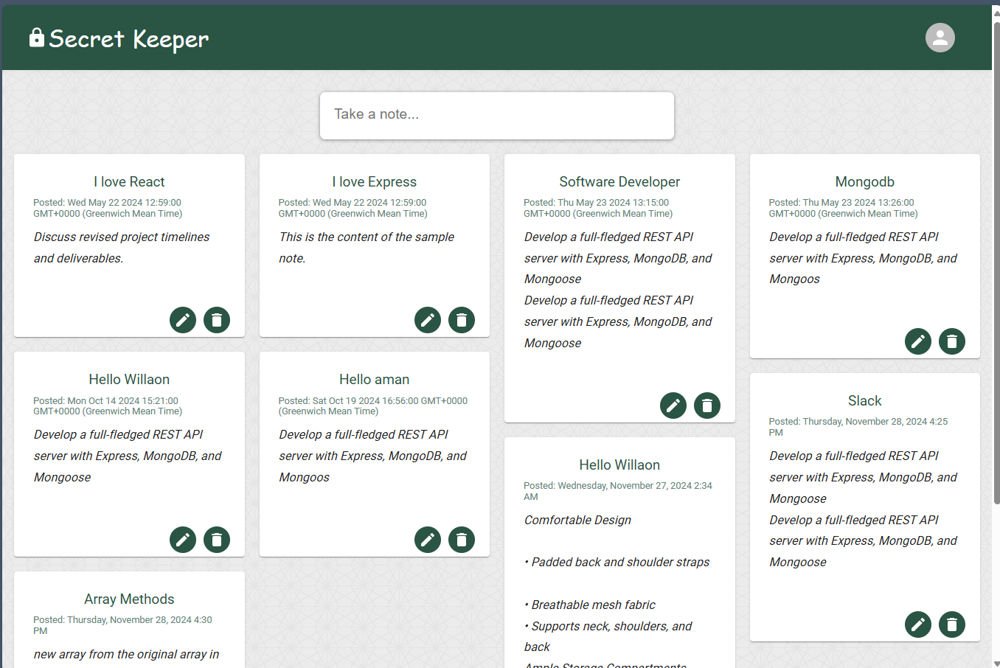
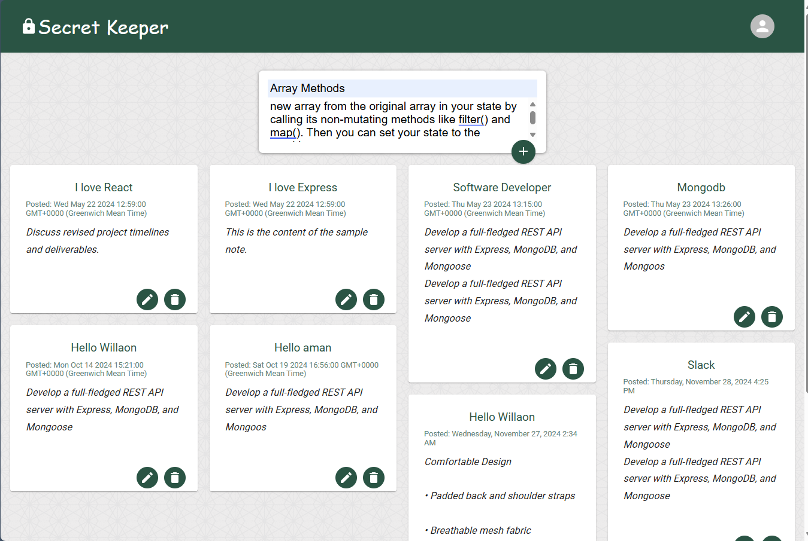

## Keeper-App-Frontend

### Overview

The frontend of the note app is built using React (with Create React App) and Material UI. 
It provides the user interface for note management and communicates with the backend to 
handle CRUD operations. The production version of the app can be accesed at 
https://keeper-app-frontend-eta.vercel.app/

# Keeper App

This is a description of the project.
Home page

Keeper page

Create Note page

## Features

    User authentication (login/logout).
    CRUD operations for managing notes.
    Notes displayed in a masonry grid layout.
    Protected routes for authenticated users.

### Installation

1. Clone the repository for the frontend:
    git clone <frontend-repo-url>

2. Navigate to the frontend directory:
    cd keeper-app-frontend

3. Install dependencies:
    npm install

4. Start the frontend development server:
    npm start

The frontend will now be running on http://localhost:3000.

## Frontend Technologies Used

    React
    Material UI
    Masonry-React-CSS
    Cors (for API requests)
    React Router (for routing)
    CSS (for custom styling)
    JWT Authentication (for protected routes)

## How to Use

    User Authentication
    Login:
    Users must log in with their credentials.
    Upon successful login, a JWT token is generated and sent to the browser in a secure httpOnly cookie.
    Since the httpOnly flag is enabled, the cookie is not accessible via JavaScript, enhancing security against XSS attacks.
    The cookie is automatically included in requests sent to the server, allowing the server to authenticate the user.

    Create a Note:
    Once logged in, users can add notes. The notes will be saved in the MongoDB database and displayed on the homepage in a masonry layout.

    Edit a Note:
    Users can edit their notes. When a note is updated, the changes will be reflected on the frontend.
    
    Delete a Note:
    Users can delete their notes, and they will no longer be displayed in the list.

## License
    This project is licensed under the MIT License.